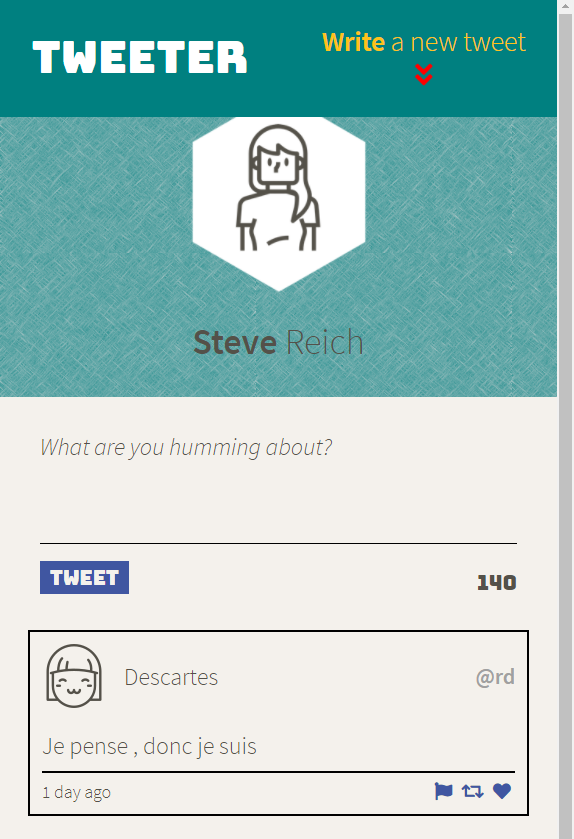

# Tweeter Project

- [About](#about)
- [Features](#features)
- [Final product](#final-product)
- [Usage](#usage)
- [Dependencies](#dependencies)
- [Development dependencies](#development-dependencies)

---

## About

Tweeter is a simple, single-page Twitter clone.

---

## Features

The application allows users to post short tweets of up to 140 characters long.

All features are implemented, including the **stretch** components of the project:

- The `new tweet form` slides up and down when the `compose button` in the navigation bar  is pressed.
- The `textarea` in the form is automatically focused on slide down.
- A second button appears in the lower right corner when the `main` area is scrolled down.
- Pressing this button scrolls back to the top of the `main` area.
- This also slides down the `new tweet form` if necessary.
- Only one of the two buttons is shown at a time:
  - the `compose` button when the `main` area is at the top,
  - the lower button otherwise.

In order to practice different techniques, the application combines a variety of approaches:

- **CSS transitions** (highlights on hover)
- **CSS animations** (cyclical translations of the icons in the two buttons)
- **jQuery animations** (slideUp, slideDown, scrolling)

The layout is reorganized responsively with a **CSS grid** to adjust to different screen sizes.

The stylesheets have been refactored using **SASS preprocessing** features:
 
 - variables
 - nesting
 - modules
 - mixins

---

## Final product

#### Narrow display



#### Wide display scrolled to the top


#### Wide display scrolled down


#### Wide display with error message


---

## Usage

Clone the repository with [git](https://git-scm.com/):
```
git clone git@github.com:ycandau/tweeter.git
```

Install all the dependencies with [npm](https://www.npmjs.com/):
```
npm install
```

Start the development web server:
```
npm run local
```

Then use any browser as a client at:
```
localhost:8080
```

---

## Dependencies

- Node.js
- body parser
- chance
- express
- md5

---

## Development dependencies

- nodemon
- sass
